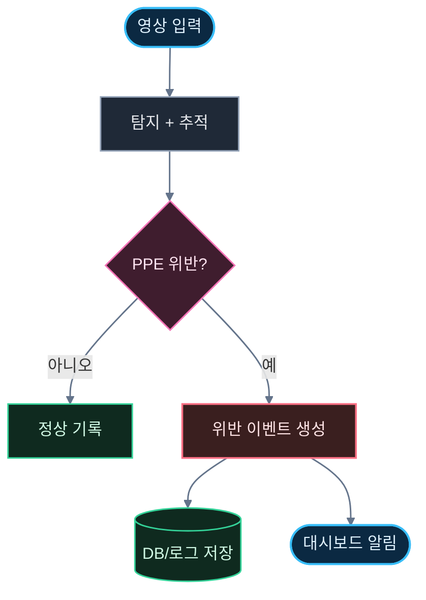

# PPE 영상 처리 파이프라인 (초간략 버전)

```mermaid
flowchart TB
  classDef io fill:#0b2942,stroke:#38bdf8,color:#e0f2fe,stroke-width:2px;
  classDef process fill:#1f2937,stroke:#94a3b8,color:#e5e7eb,stroke-width:1.5px;
  classDef decision fill:#3f1d2e,stroke:#f472b6,color:#ffe4f1,stroke-width:1.5px;
  classDef alert fill:#3a1f1f,stroke:#fb7185,color:#ffe4e6,stroke-width:1.8px;
  classDef save fill:#0f2a1f,stroke:#34d399,color:#d1fae5,stroke-width:1.5px;

  A([영상 입력]):::io --> B[탐지 + 추적]:::process
  B --> C{PPE 위반?}:::decision

  C -->|아니오| D[정상 기록]:::save
  C -->|예| E[위반 이벤트 생성]:::alert

  E --> F[(DB/로그 저장)]:::save
  E --> G([대시보드 알림]):::io

  linkStyle default stroke:#64748b,stroke-width:1.5px;
```

## VS Code
- `.mmd`: `View: Show Mermaid Chart`
- `.md`: `Ctrl+Shift+V`
