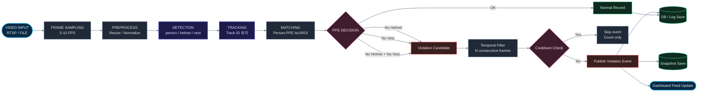

# PPE Video Processing Pipeline (Styled Mermaid)

```mermaid
flowchart LR
  %% =====================
  %%  PPE Pipeline (Styled)
  %% =====================

  classDef io fill:#0b2942,stroke:#38bdf8,color:#e0f2fe,stroke-width:2px;
  classDef prep fill:#1f2937,stroke:#94a3b8,color:#e5e7eb,stroke-width:1.5px;
  classDef ai fill:#1e1b4b,stroke:#818cf8,color:#e0e7ff,stroke-width:1.5px;
  classDef rule fill:#3f1d2e,stroke:#f472b6,color:#ffe4f1,stroke-width:1.5px;
  classDef alert fill:#3a1f1f,stroke:#fb7185,color:#ffe4e6,stroke-width:1.8px;
  classDef save fill:#0f2a1f,stroke:#34d399,color:#d1fae5,stroke-width:1.5px;

  A([VIDEO INPUT\nRTSP / FILE]):::io --> B[FRAME SAMPLING\n5-10 FPS]:::prep
  B --> C[PREPROCESS\nResize / Normalize]:::prep
  C --> D[DETECTION\nperson / helmet / vest]:::ai
  D --> E[TRACKING\nTrack ID 유지]:::ai
  E --> F[MATCHING\nPerson-PPE IoU/ROI]:::prep
  F --> G{PPE DECISION}:::rule

  G -->|OK| H1[Normal Record]:::save
  G -->|No Helmet| H2[Violation Candidate]:::alert
  G -->|No Vest| H2
  G -->|No Helmet + No Vest| H2

  H2 --> I[Temporal Filter\nN consecutive frames]:::prep
  I --> J{Cooldown Check}:::rule

  J -->|Yes| K[Skip event\nCount only]:::prep
  J -->|No| L[Publish Violation Event]:::alert

  L --> M[(Snapshot Save)]:::save
  L --> N[(DB / Log Save)]:::save
  L --> O([Dashboard Feed Update]):::io
  H1 --> N

  linkStyle default stroke:#64748b,stroke-width:1.5px;
```

## VS Code
- `.mmd`: Command Palette → `View: Show Mermaid Chart`
- `.md`: `Ctrl+Shift+V` (Markdown Preview)
