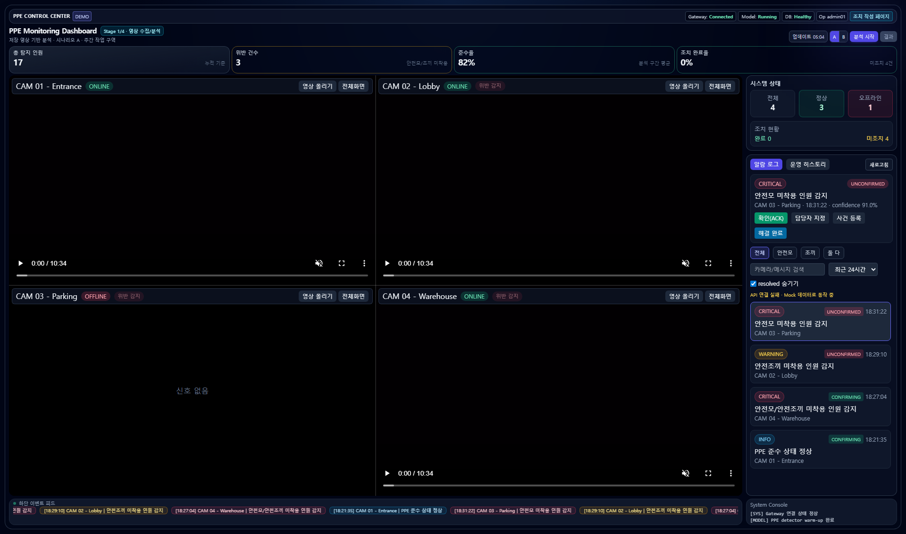
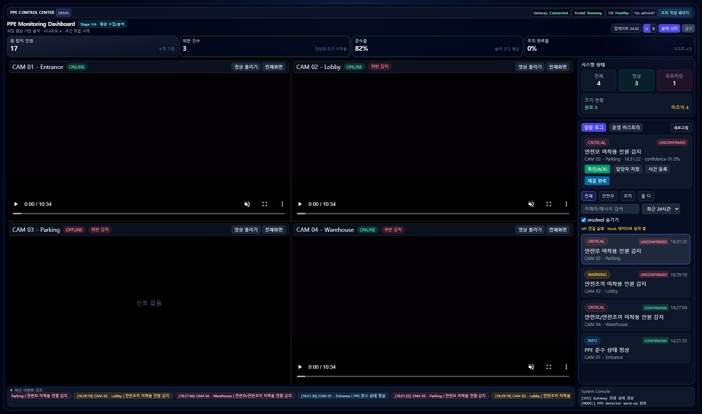
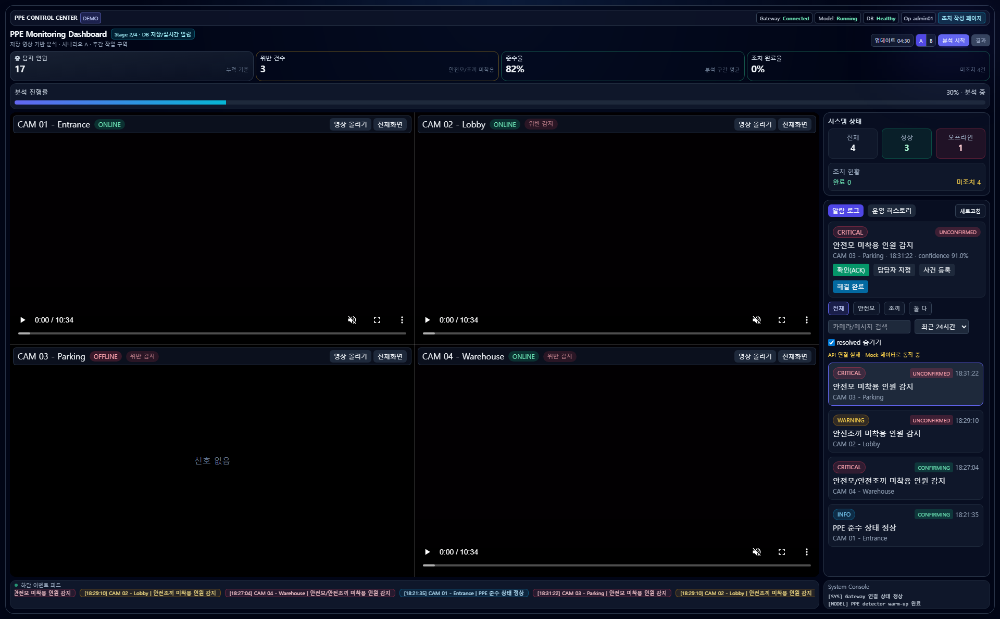
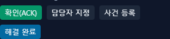
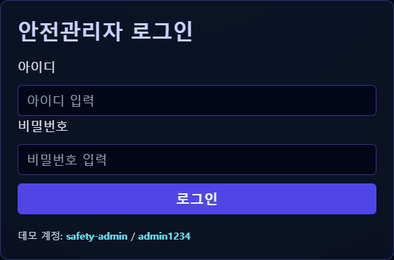
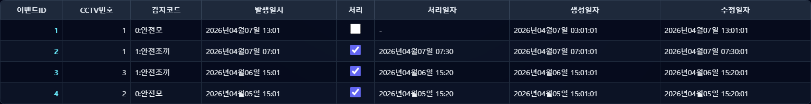

# PPE Monitoring Dashboard

저장 영상 기반 PPE(안전모/안전조끼) 분석 시스템을 가정한 **프론트엔드 시연용 관리자 대시보드**입니다.

> 현재는 백엔드 없이 UI/UX 프로토타입에 집중한 버전입니다.

---

## 📌 프로젝트 목적

- 산업안전 현장에서 PPE 착용 여부를 모니터링하는 시스템의 화면을 설계
- 발표/시연에서 분석 흐름(업로드 → 분석 진행 → 결과 확인)을 직관적으로 전달

---

## ✨ 주요 기능

- 4분할 CCTV 모니터링 화면
- CAM별 개별 영상 업로드 (로컬 파일)
- 관리자 사이드 패널
  - 시스템 상태 카드
  - 알람 로그(필터/검색)
  - 운영 히스토리
- 상단 KPI 카드
  - 총 탐지 인원 / 위반 건수 / 준수율 / 조치 완료율
- 시나리오 A/B 전환
- 분석 진행률 UI (Mock)
- 분석 완료 모달
- 하단 이벤트 피드(Ticker)
- 조치 작성 페이지 + 로그인 게이트

---

## 🛠 Tech Stack

- React (Vite)
- Tailwind CSS

---

## 🚀 실행 방법

```bash
npm install
npm run dev
```

- 기본 접속: `http://localhost:5173`

### Production Build

```bash
npm run build
```

---

## 🧭 데모 시연 흐름 (추천)

1. 시나리오 A/B 전환
2. CAM 카드별 `영상 올리기` 버튼으로 로컬 영상 업로드
3. `분석 시작` 버튼 클릭
4. 진행률 증가 확인
5. 분석 완료 모달 및 KPI/로그 확인
6. 알람 상세에서 `확인/담당자 지정/사건 등록/해결 완료` 시연
7. `조치 작성 페이지`로 이동 후 조회/수정 시연

---

## 📸 스크린샷 가이드 (버튼별 기능 문서화)

발표/포트폴리오용으로 버튼 기능을 빠르게 이해시키기 위해, 아래 형식으로 스크린샷을 추가합니다.

### 스크린샷 파일 규칙

- 경로: `docs/screenshots/`
- 파일명 예시:
  - `01-dashboard-overview.png`
  - `02-cam-upload-button.png`
  - `03-analysis-start.png`
  - `04-alert-action-buttons.png`
  - `05-action-page-login.png`
  - `06-action-page-table.png`

### UI Quick Guide (전체 화면)



- ① CAM 모니터링 영역
- ② 상단 제어 버튼(시나리오/분석 시작/결과)
- ③ 알람 로그 및 상세 조치
- ④ 하단 이벤트 피드

---

## 🔘 버튼별 기능 & 사용법

> 아래는 템플릿입니다. 스크린샷 교체 후 그대로 사용하면 됩니다.

### 1) CAM별 `영상 올리기`



- **기능:** 특정 카메라 타일에 로컬 영상 파일 연결
- **사용법:** CAM 카드 우측 상단 `영상 올리기` 클릭 → 파일 선택
- **결과:** 해당 CAM에만 영상 적용, `LOCAL VIDEO` 배지 표시

### 2) `분석 시작`



- **기능:** 분석 시뮬레이션 시작
- **사용법:** (선택) 시나리오 A/B 설정 → `분석 시작`
- **결과:** 진행률 바 활성화, 완료 시 모달 표시

### 3) 알람 조치 버튼 (`확인/담당자 지정/사건 등록/해결 완료`)



- **기능:** 알람 상태 전이 및 조치 기록
- **사용법:** 알람 선택 → 조치 버튼 클릭 → 모달에서 저장
- **결과:** 상태값 갱신 + 운영 히스토리 반영

### 4) `조치 작성 페이지` 진입



- **기능:** 조치 전용 화면으로 이동
- **사용법:** 상단 `조치 작성 페이지` 버튼 클릭
- **결과:** 로그인 화면으로 이동

### 5) 조치 페이지 `로그인`


- **기능:** 안전관리자 권한 확인
- **사용법:** ID/PW 입력 후 로그인
- **데모 계정:** `safety-admin / admin1234`
- **결과:** 조치 테이블 화면 접근 허용

### 6) 조치 페이지 `조회/수정 저장`



- **기능:** 이벤트 조회 및 처리 상태 수정
- **사용법:** 이벤트ID/처리필터 설정 → `조회` → 체크박스 수정 → `수정 저장`
- **결과:** 처리/수정일자 갱신 (Demo)

---

## 🧱 현재 코드 구조 (리팩터링 반영)

- `src/data/mockData.js` : 더미 데이터 분리
- `src/constants/statusStyles.js` : 알람 레벨 스타일 상수
- `src/components/`
  - `KpiCard`, `FilterButton`, `StateTile`
  - `ViolationActionPage` (로그인 + 조치 작성)
- `src/services/alertsApi.js` : API 호출 골격

## 🔌 API 연결 골격

현재 앱은 시작 시 아래 엔드포인트를 시도합니다.

- `GET /api/alerts/latest`
- `PATCH /api/alerts/:id/status`

성공 시 최신 알람/상태로 반영되고,
실패 시에는 **Mock 데이터 fallback** 으로 동작합니다.

## 🔮 추후 확장 (백엔드 연동 시)

- FastAPI + YOLO 기반 분석 API 연결
- 조치 작성 페이지 조회/수정 API 연동
- 분석 결과(JSON/CSV) 다운로드
- 결과 영상(mp4) 연동
- 실시간(WebSocket) 이벤트 반영

---

## 📎 참고

이 프로젝트는 **프론트 시연/포트폴리오 목적**으로 제작되었습니다.
